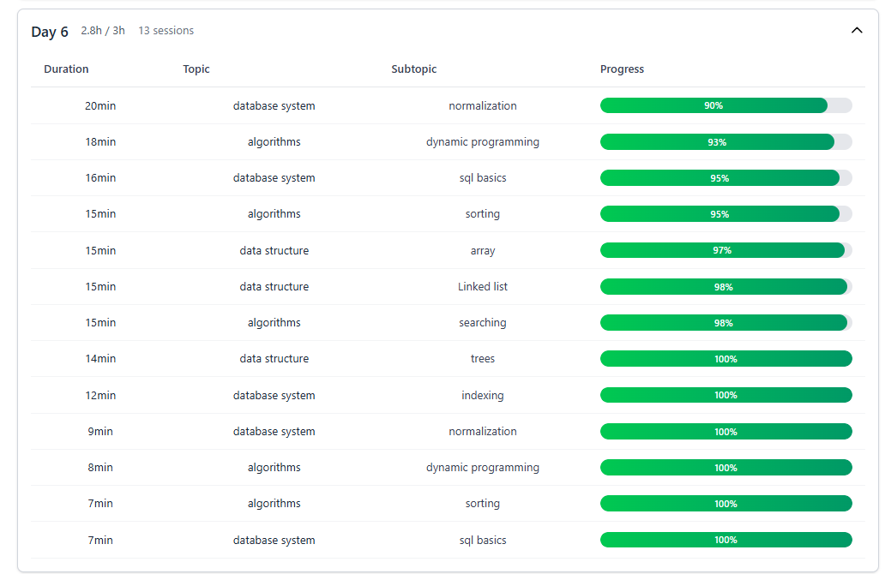

# 📚 Aura Planner - Study Planner Assistant

> **Smart Study Scheduling Made Simple**  
> An intelligent study planner that helps students create personalized, difficulty-weighted study schedules with automatic revision planning.


---

## 🎯 What is Aura Planner?

Aura Planner is a **web-based study scheduling assistant** that takes the stress out of exam preparation. Simply input your topics, available study time, and difficulty levels - and let the algorithm create an optimized study plan with built-in revision sessions.

### ✨ Key Features

- 📊 **Difficulty-Weighted Scheduling** - Topics are allocated time based on their difficulty (1-5 scale)
- 🔄 **Smart Revision Strategy** - Last day automatically reserved for revision of learned topics
- 📈 **Progress Tracking** - Visual progress bars show completion percentage for each day
- 📱 **Responsive Design** - Works seamlessly on desktop, tablet, and mobile
- 🌙 **Dark Mode** - Easy on the eyes for late-night study planning
- 📄 **PDF Export** - Export your study plan as a professional PDF document
- 🎨 **Modern UI** - Built with Tailwind CSS for a clean, intuitive interface

---

## 🚀 Quick Start

### Prerequisites

- **Node.js** (v14 or higher)
- **npm** (v6 or higher)

### Installation & Setup

1. **Clone the repository**

   ```bash
   git clone https://github.com/Arhum19/Study-Planner-Assistant.git
   cd Study-Planner-Assistant
   ```

2. **Install Frontend Dependencies**

   ```bash
   cd auraplanner
   npm install
   ```

3. **Install Backend Dependencies**

   ```bash
   cd ../backend
   npm install
   ```

4. **Start the Backend Server**

   ```bash
   # From the backend directory
   npm start
   ```

   - Backend runs on: `http://localhost:5000`

5. **Start the Frontend Development Server**

   ```bash
   # Open a new terminal, navigate to auraplanner directory
   cd auraplanner
   npm run dev
   ```

   - Frontend runs on: `http://localhost:5174`

6. **Open Your Browser**
   - Navigate to `http://localhost:5174`
   - Start planning your study schedule! 🎉

---

## 📖 How to Use

### Step 1: Enter Schedule Details

Fill in the basic information about your study schedule:

- **Number of Days**: How many days until your exam?
- **Available Hours**: How many hours can you study each day?

### Step 2: Add Topics

For each topic you need to study:

1. **Topic Name**: e.g., "Data Structures"
2. **Difficulty Level**: Rate from 1 (Easy) to 5 (Very Hard)
3. **Subtopics** (Optional): Break down the topic into smaller chunks
   - Each subtopic has a name and percentage weightage
   - Subtopic percentages should add up to 100%

### Step 3: Generate Plan

Click **"Generate Study Plan"** and watch the algorithm create your personalized schedule!

### Step 4: Review & Export

- Expand/collapse days to see detailed sessions
- View progress bars for each day
- Export to PDF for printing or sharing

---

## 💡 Example Usage

### 📥 Example Input

**Schedule Configuration:**

- **Days**: 7 days
- **Daily Hours**:
  - Days 1-6: 4 hours each
  - Day 7: 3 hours

**Topics:**

| Topic                | Difficulty | Subtopics                                                 |
| -------------------- | ---------- | --------------------------------------------------------- |
| **Data Structures**  | 5          | Arrays (30%), Linked Lists (35%), Trees (35%)             |
| **Algorithms**       | 4          | Sorting (40%), Searching (30%), Dynamic Programming (30%) |
| **Database Systems** | 3          | SQL Basics (50%), Normalization (30%), Indexing (20%)     |

**📸 Input Screenshot:**

> 

---

### 📤 Example Output
**Days 1-6: Learning Phase**

- Each day contains study sessions for different topics/subtopics
- Sessions are allocated based on difficulty weights
- Progress bars show completion percentage

**Day 7: Revision Phase**

- Final day reserved exclusively for revision
- Reviews all topics covered in previous days
- Organized revision sessions





**📸 Export PDF Screenshot:**

> 
---

## 🏗️ Project Structure

```
Study-Planner-Assistant/
│
├── auraplanner/              # Frontend (React + Vite)
│   ├── src/
│   │   ├── components/       # React components
│   │   │   ├── DayDropdown.jsx
│   │   │   ├── ExportButton.jsx
│   │   │   ├── PlanView.jsx
│   │   │   ├── ProgressBar.jsx
│   │   │   └── TopicForm.jsx
│   │   ├── pages/
│   │   │   └── PlannerPage.jsx
│   │   ├── App.jsx
│   │   └── main.jsx
│   ├── package.json
│   └── vite.config.js
│
├── backend/                  # Backend (Node.js + Express)
|   |__data/
|   |   └── plans.json        # Persisted study plans
|   ├── node_modules/
│   ├── src/
│   │   ├── scheduler.js      # Core scheduling algorithm
│   │   └── server.js         # Express server
│   └── package.json
│
└── documentation/            # Project documentation
    ├── ProblemStatement.md
    ├── AI-log.md
    ├── TestPlan.md
    ├── UseCases.md
    └── ReleaseRoadmap.md
```

---

## 🛠️ Technology Stack

### Frontend

- **React 18** - UI framework
- **Vite** - Build tool and dev server
- **Tailwind CSS** - Utility-first CSS framework
- **Lucide React** - Icon library

### Backend

- **Node.js** - JavaScript runtime
- **Express.js** - Web framework
- **CORS** - Cross-origin resource sharing

## 📊 Algorithm Details

### Difficulty Weighting System

```javascript
DIFFICULTY_WEIGHTS = {
  1: 1.0, // Easy
  2: 1.2, // Medium-Easy
  3: 1.4, // Medium
  4: 1.7, // Medium-Hard
  5: 2.0, // Very Hard
};
```

### Scheduling Strategy

1. **Last Day Reservation**: Final day is exclusively for revision
2. **Learning Phase**: Days 1 to N-1 for new content
3. **Time Allocation**: Topics receive time proportional to difficulty × weight
4. **Dynamic Distribution**: Sessions spread across available days
5. **Progress Calculation**: Based on time consumed vs. allocated

### Key Constraints

- Minimum session duration: 15 minutes (0.25h)
- Revision only for topics with consumed time > 0.01h
- All topics distributed regardless of time constraints
- Progress shows realistic completion percentage

---

## 🎨 Features Showcase

### Expand/Collapse All

- Toggle all days open or closed with one click
- Individual day expansion for focused viewing

### Dark Mode

- System-friendly dark theme
- Reduces eye strain during late-night planning
- Persistent preference

### Responsive Design

- Mobile-first approach
- Touch-friendly controls
- Adapts to any screen size

### PDF Export

- Professional table format
- Color-coded session types (Learning vs. Revision)
- Print-ready layout
- Browser-based (no external dependencies)

---

## 📚 Documentation

Comprehensive documentation is available in the `/documentation` folder:

- **[ProblemStatement.md](documentation/ProblemStatement.md)** - Project overview and scope
- **[AI-log.md](documentation/AI-log.md)** - Development journey and evolution
- **[TestPlan.md](documentation/TestPlan.md)** - Test cases and validation
- **[UseCases.md](documentation/UseCases.md)** - Use cases and system design
- **[ReleaseRoadmap.md](documentation/ReleaseRoadmap.md)** - Future feature roadmap

---

## 🐛 Known Limitations

- **No Persistence**: Plans are not saved (coming in v2.0 with database)
- **Single User**: No multi-user support or authentication
- **Static Resources**: No external learning resource links yet
- **No Mobile App**: Web-only (mobile apps planned for 2026)

---

## 🚀 Future Roadmap

### 3-Month Plan (Q1 2026)

- 🔐 User authentication (JWT)
- 💾 Database integration (MongoDB)
- 📧 Email notifications
- 🌐 Multi-language support
- 📊 Analytics integration

### 1-Year Plan (2026)

- 🤖 AI-powered schedule optimization
- 📱 Mobile applications (iOS & Android)
- 🔗 Topic resource links
- 🤝 Study buddy system
- 🔔 Smart notifications & alarms

### 2-Year Plan (2027)

- 💳 Premium subscription model
- 👨‍🏫 Personal teacher consultations
- 📹 Live classes & recorded content
- 🤖 AI study coach
- 🎙️ Voice commands

See **[ReleaseRoadmap.md](documentation/ReleaseRoadmap.md)** for complete details.

---

## 🤝 Contributing

Contributions are welcome! Here's how you can help:

1. Fork the repository
2. Create a feature branch (`git checkout -b feature/AmazingFeature`)
3. Commit your changes (`git commit -m 'Add some AmazingFeature'`)
4. Push to the branch (`git push origin feature/AmazingFeature`)
5. Open a Pull Request

---

## 📄 License

This project is licensed under the MIT License - see the LICENSE file for details.

---

## 👨‍💻 Author

**Arhum19**

- GitHub: [@Arhum19](https://github.com/Arhum19)
- Repository: [Study-Planner-Assistant](https://github.com/Arhum19/Study-Planner-Assistant)

---

## 🙏 Acknowledgments

- Built with ❤️ for students struggling with study planning
- Special thanks to the open-source community
- Inspired by the need for smarter exam preparation tools

---

## 📞 Support

If you encounter any issues or have questions:

- 🐛 [Open an issue](https://github.com/Arhum19/Study-Planner-Assistant/issues)
- 💬 Start a discussion in the repository
- 📧 Contact the maintainer

---

## ⭐ Show Your Support

If you find this project helpful, please consider:

- ⭐ Starring the repository
- 🍴 Forking and contributing
- 📢 Sharing with fellow students

---
